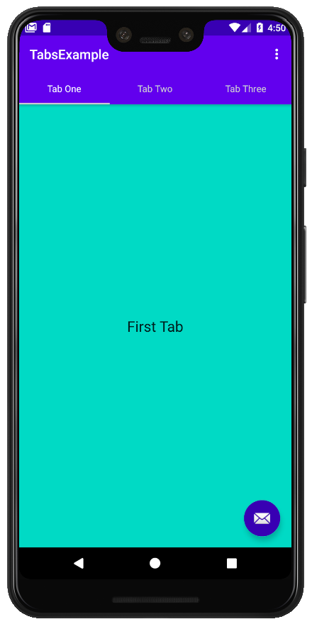
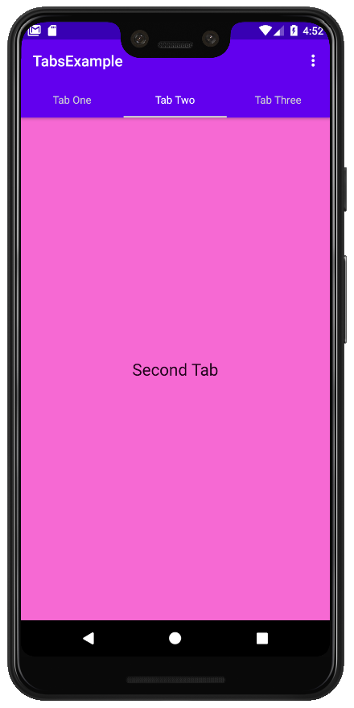
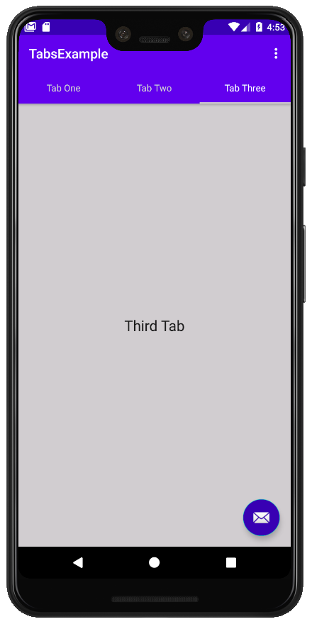

# TabLayout-Kotlin
Implementing TabLayout &amp; ViewPager using Kotlin

## Creating fragments, viewpager, and tablayout.


Defining two or three empty fragments:

```
// Defining a view in my first tab
class FirstFragment : Fragment() {
    override fun onCreateView(
        inflater: LayoutInflater, container: ViewGroup?,
        savedInstanceState: Bundle?
    ): View? {
        // Inflate the layout for this fragment
        return inflater.inflate(R.layout.fragment_first, container, false)
    }

    override fun onViewCreated(
        view: View,
        savedInstanceState: Bundle?
    ) {
        super.onViewCreated(view, savedInstanceState)
    }
}
```

Defining viewpager and tablayout in .xml file (separate or together):

```
    <androidx.viewpager.widget.ViewPager
    android:id="@+id/mainViewPager"
    android:layout_width="match_parent"
    android:layout_height="match_parent"
    />
    ...
    ...
    ...
    <com.google.android.material.tabs.TabLayout
    android:id="@+id/mainTabLayout"
    android:layout_width="match_parent"
    android:layout_height="wrap_content"
    app:tabBackground="@color/colorPrimary"
    app:tabIndicatorColor="@color/colorLightGrey"
    app:tabTextColor="@color/colorLightGrey"
    app:tabSelectedTextColor="@android:color/white"
    app:tabRippleColor="@color/colorPrimaryDark"
    app:tabTextAppearance="@android:style/TextAppearance.Widget.TabWidget"
    />

```

In my MainActivity must be declared all components such as:

```
   private var viewPager: ViewPager? = null
```

Use kotlin synthetics or look the components using findViewById method such as:

```
   viewPager = findViewById(R.id.mainViewPager)
```

Include an inner class in MainActivity to extend to FragmentPagerAdapter:

```
  //**************************************************************
  // INNER CLASS PAGER ADAPTER
  //**************************************************************
    internal class MyPagerAdapter(fm: FragmentManager, behavior: Int) : FragmentPagerAdapter(fm, behavior) {
    ...
    ...
```

Finally, I setup viewpager and tabs such as.

```
    myPagerAdapter = MyPagerAdapter(supportFragmentManager, FragmentPagerAdapter.BEHAVIOR_RESUME_ONLY_CURRENT_FRAGMENT)
    tabLayout!!.setupWithViewPager(viewPager)
    viewPager!!.adapter = myPagerAdapter
```

**I can define some specific behavior in each tab (fragment). For example, Tab1 and Tab3 show a FloatingActionButton, but Tab 2 does not show it. See code for details.**

## Final Result:

<p align="center">
  

</p>

